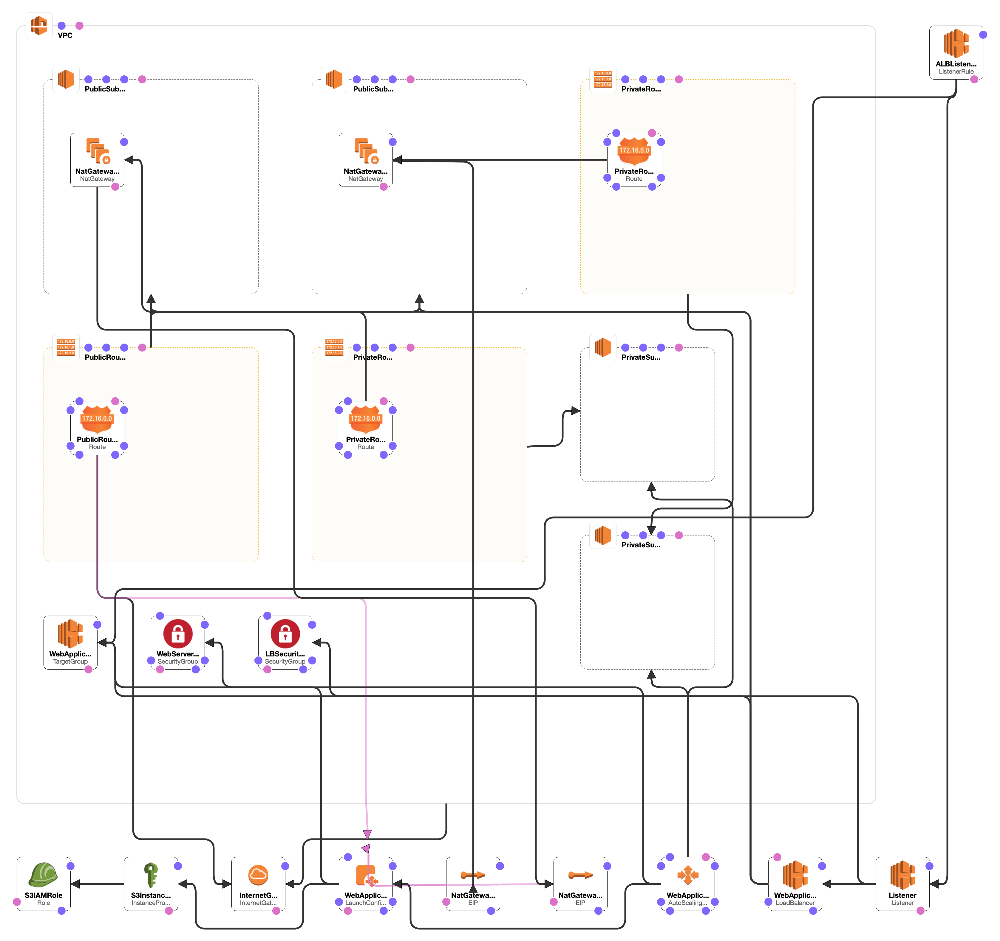

# CloudFormation High Availability Template

Creating AWS highly available infrastructure with ec2 auto scaling groups and load balancers.

## AWS Services Used

- EC2
- CloudFormation
- IAM

## Stack



## Resources Created

- 1 VPC
- 2 Public Subnets
- 2 Private Subnets where application will be deployed
- Internet Gateway to access internet
- 2 Elastic IPs for NatGateways
- 2 NatGateways each to be atached to private subnets
- 3 RouteTable one for public and two for private subnets
- 4 RouteTable associations for each subnets to their respective RouteTable
- 1 Public route for connecting to internet
- 2 Private route for connecting to NAT Gateway
- 2 Security Groups for LoadBalancer and Servers
- 1 IAM Role for accessing S3 bucket
- 1 Instance Profile which will be attached to EC2
- 1 Target group for LoadBalancer
- 1 LaunchConfiguration for instance template
- 1 Instance Group
- 1 Application LoadBalancer
- 1 ALB port listner
- 1 ALB Listner rule for path pattern

## Create Stack

If you are creating the stack for the first time.

```bash
bash create.sh
```

## Update Stack

If you are  tweaking the cloudformation template, use the following command to update the stack

```bash
bash update.sh
```
